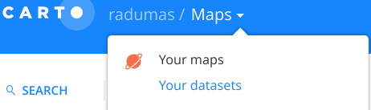
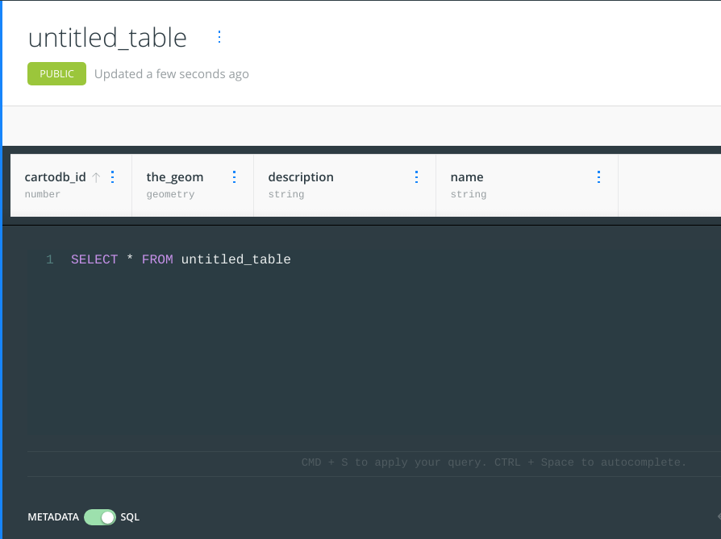
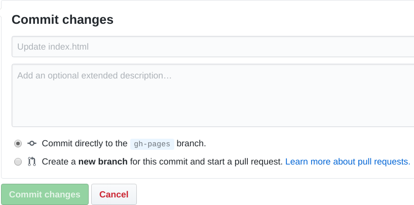

# Crowdmap: Basic
This is an attempt to create the most basic example of a web map for crowdsourcing... anything that users can draw on a map (points, squares, circles, lines, polygons...).
It uses [Leaflet.draw](https://github.com/Leaflet/Leaflet.draw) ([demo](https://leaflet.github.io/Leaflet.draw/)), an extension of the [Leaflet](http://leafletjs.com/reference.html) javascript mapping library to enable users to draw shapes on a map and then inserts them in a [Carto table](https://carto.com/data-observatory/). The webmap is hosted on [gh-pages](https://pages.github.com/), which allows you to host free static websites on github, the codesharing website that you're reading this on currently. The only permitted behaviour is for users to view previously submitted input and to submit their own input. Editing or deleting input is not permitted. Examples of possible implementations include:
 - [Mapping neighbourhood boundaries](http://bostonography.com/hoods) ([code](https://github.com/mjfoster83/neighborhoods)) 
 - [Collecting data on traffic safety issues](http://app01.cityofboston.gov/VZSafety/#_=_)
 - [Soliciting input on routes and points for better biking infrastructure](http://boston-cyclists-union.github.io/bikeways4everybody) (based on this workshop, [code here](https://github.com/radumas/bikeways4everybody))

[](http://radumas.github.io/crowdmap-basic)  
[Try it here](http://radumas.github.io/crowdmap-basic)

# Table of Contents
### 1. [Set up guide](#guide)  
#### - [Set Up Accounts and Fork Repository](#set-up-accounts-and-fork-repository)

### 2. [Now what?](#now-what)  
### 3. [How it works](#how-it-works)  


# Guide
## Set Up Accounts and Fork Repository

1. Get a [github](https://github.com/join) and a [carto](https://carto.com/signup) account.
  + (*Optional*) Mac & Windows users can install the [Github Desktop Software](https://desktop.github.com/)
2. Fork the repository by clicking on the [fork icon](#js-flash-container) at the top right of this page, like the image below. To learn more about forking, click [here](https://help.github.com/articles/fork-a-repo/).
[](#js-flash-container)  

## After Forking this Repository

### Set up a Carto Database

1. Create a new Carto dataset. Find datasets by navigating to the top left, click on `Maps` and then `Your Datasets`. On that page click the `NEW DATASET` button on the right and then click `CREATE EMPTY DATASET` on the right.


2. The default dataset comes with the following fields: `{cartodb_id, the_geom, description, name}`
   Each row represents one submission from the map with the first field a unique id assigned by Carto to each geometry. `the_geom` is the geographic object. `description` is the user input description of the shape, and `name` is the user's name. **Click** on `untitled_table` to give your table a unique name. Remember this name, though the rest of this tutorial uses `crowdmap_basic` as the tablename.

3. In the bottom left corner, slide the circle from `METADATA` to `SQL` to enable writing arbitrary SQL. SQL stands for Structured Query Language and it's a standardized programming language for databases that comes in a number of flavours for different database engines (Oracle, Microsoft SQL Server). Carto uses PostgreSQL under the hood.

4. Copy and paste the contents of `insert_function.sql` ([located here](insert_function.sql)) into the SQL pane (it has `SELECT * FROM untitled_table` in the image :point_up:), and then modify the name of the table to be inserted (if you changed the table name) in step 2 of this section:  
	```
	_the_table TEXT := 'crowdmap_basic';
	```  
	This function allows you to send data from the map to the Carto using a publicly accessible URL while limiting what functions the public can perform on the data (for example, the public can't modify or delete existing data). This function takes the drawn shape as a GeoJSON, the description, and the username. It converts the GeoJSON to a PostGIS geometry object and then inserts a new row in the table with the geometry, and the other two user-input values. Since it isn't easy to view saved functions in Carto, I recommend saving the function in a text file.  
	**If you have multiple tables** (because you're creating multiple maps, or you're teaching this workshop multiple times) see below for more information on keeping track of multiple files. Else go down to [**Edit HTML**](#edit-html)

**Multiple tables:** you need to create a unique function for each, it's probably a good idea to save each function as a separate file so you can recall what is on your Carto account. Alternatively you can see which functions have been created with the following `sql` query ([source](http://stackoverflow.com/a/1559039/4047679)):  
```sql  
SELECT  proname, proargnames, prosrc 
FROM    pg_catalog.pg_namespace n
JOIN    pg_catalog.pg_proc p
ON      p.pronamespace = n.oid
WHERE   n.nspname = 'public' 
AND		p.proowner <> 10
```	 
### Edit HTML
You can download the contents of this repository as a folder (called [cloning](https://help.github.com/articles/cloning-a-repository/)) so you can modify and test it on your personal machine rather than displaying it on the web. If you're interested in that I'd recommend starting by downloading [GitHub Desktop](https://desktop.github.com/).

However, the goal of this tutorial is to entirely use web tools, so we'll modify things in your browser. `index.html` is the lobby for the webpage for this project. This is a combination of html, CSS, and JavaScript code that tells your browser how to render the map prettily and where to send your data.  

1. You can edit this file directly in your web-browser by clicking on the [`index.html`](index.html) filename above :point_up: and then clicking on the :pencil: icon in the top right. Modify the following variables in `index.html` (search for "TODO"):   
   - `cartoDBusername` to your Carto username
   - `cartoDBinsertfunction` to the name of your insert function (if you changed it)
   - `cartoDBtablename` to the name of your table in Carto (if you changed it)
2. Commit your changes! A "Commit" is equivalent to saving a document in Version Control, but instead it saves the difference to the document, so you can see it's entire history on GitHub as well as useful notes for yourself or collaborators on what you actions you took in your commit. You commit by navigating to the bottom of the page :point_down: where you were editing where you'll see the below box. You can leave the empty defaults but it's good practice to write meaningful messages.

3. After your modifications are committed, GitHub will build and publish your project on the web. Go to http://YOURGITHUBUSERNAME.github.io/crowdmap-basic to see your own map, and start submitting data, you can see the submitted data by going to the data view for that table in your Carto account.
4. :tada: Give yourself a pat on the back! This may be the end of the workshop, but this is just the beginning.
5. Modify the code to your whims ([now what?](#now-what)). 

# Now What?
What to do and modify on your map once it's working. Have a look at the different parameters in the `config` variable in [`index.html`](index.html) to get a sense of what you can modify:
 - **Where the map is focused** on with the `mapcenter` parameter
 - **The shapes that can be drawn** (line, marker, etc...) under the `drawOptions` parameters. See more Leaflet.Draw options [here](https://github.com/Leaflet/Leaflet.draw#options)  
     + You can also enable editing and deleting of shapes, however this will require additional configuration of the function that communicates with the Carto database, see [this Carto tutorial](https://carto.com/blog/read-and-write-to-cartodb-with-the-leaflet-draw-plugin/) for more details. (**Note**: that Carto example may be vulnerable to SQL Injection, see [here](https://dba.stackexchange.com/questions/49699/sql-injection-in-postgres-functions-vs-prepared-queries))
 - **The base map** (background) by modifying `var CartoDB_Positron = L.tileLayer(...)`, you can test a number [here](https://leaflet-extras.github.io/leaflet-providers/preview/)
 - **The map style** (e.g. height, width, font) by modifying [`css/style.css`](css/style.css). See [this](http://flexboxfroggy.com/) quirky frog-based tutorial as an introduction to [Cascading Style Sheets](http://stackoverflow.com/a/9289668/4047679)
 - **[Advanced] what fields are collected.** This requires the modification of:
   + The table in Carto
   + The [`insert_function`](insert_function.sql) (and then re-executing this in Carto)
   + The field(s) used after `<div id="dialog" title="Tell us About this Drawing">` in `index.html`
   + The `setData()` function in `index.html`

Once you've collected data from users, have a look at the [tutorials at Carto](https://carto.com/docs/tutorials/) for what kinds of maps you can make from your data.

# How it works
## Sending Leaflet.draw data to Carto  

This section details the modifications made from the [excellent tutorial](http://duspviz.mit.edu/web-map-workshop/cartodb-data-collection/#) by Mike Foster ([@mjfoster83](https://github.com/mjfoster83/web-map-workshop)). If this is your first introduction to leaflet, you should probably go through the entire webmapping workshop  

2. Modify the `setData()` function to construct the SQL query which calls the function to insert the data to Carto.
   ```javascript
    //Convert the drawing to a GeoJSON to pass to the Carto sql database
    var drawing = "'"+JSON.stringify(layer.toGeoJSON().geometry)+"'";

    //Construct the SQL query to insert data from the three parameters: the drawing, 
    //the input username, and the input description of the drawn shape
    var sql = "SELECT insert_crowd_mapping_data(";
    sql += drawing;
    sql += ","+enteredDescription;
    sql += ","+enteredUsername;
    sql += ");";
    ```  
3. And then add the sql query to an AJAX call in order to pass the data to your Carto table
    ```javascript
    //TODO: Change to your username
    var cartoDBusername = "raphaeld"  
    //Sending the data
      $.ajax({
        type: 'POST',
        url: 'https://'+cartousername+'.cartodb.com/api/v2/sql',
        crossDomain: true,
        data: {"q":sql},
        dataType: 'json',
        success: function(responseData, textStatus, jqXHR) {
          console.log("Data saved");

        },
        error: function (responseData, textStatus, errorThrown) {

            console.log("Problem saving the data");
        }
      });
    ```
4. After each new drawing is inserted, the data from the `drawnItems` layer is passed to the `cartoData` layer without re-querying the database. This does mean that a user **won't** see others' edits to the map after load. See Mike Foster's [tutorial](http://duspviz.mit.edu/web-map-workshop/cartodb-data-collection/#) for the easy fix to reload the data from Carto after every draw.
    ```javascript
    // Transfer drawing to the Carto layer
    var newData = layer.toGeoJSON();
      newData.properties.description = description.value;
      newData.properties.name = username.value;

    cartoDBData.addData(newData);
    ```
